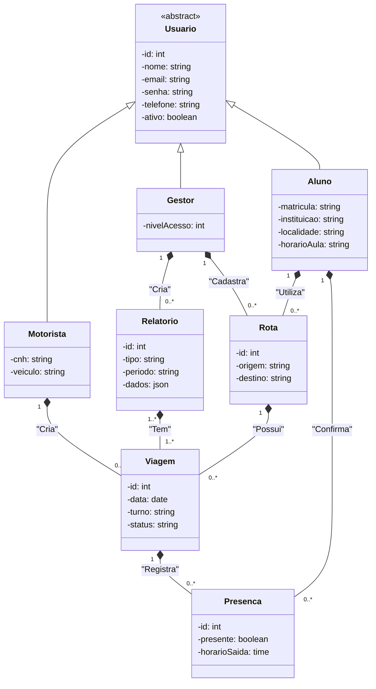

```mermaid

classDiagram
    class Usuario {
        <<abstract>>
        -id: int
        -nome: string
        -email: string
        -senha: string
        -telefone: string
        -ativo: boolean
    }

    class Aluno {
        -matricula: string
        -instituicao: string
        -localidade: string
        -horarioAula: string
    }

    class Motorista {
        -cnh: string
        -veiculo: string
    }

    class Gestor {
        -nivelAcesso: int
    }

    class Presenca {
        -id: int
        -presente: boolean
        -horarioSaida: time
    }

    class Rota {
        -id: int
        -origem: string
        -destino: string
    }

    class Viagem {
        -id: int
        -data: date
        -turno: string
        -status: string
    }

    class Relatorio {
        -id: int
        -tipo: string
        -periodo: string
        -dados: json
    }

    Usuario <|-- Aluno
    Usuario <|-- Motorista
    Usuario <|-- Gestor

    Gestor "1" *-- "0..*" Rota : "Cadastra"
    Gestor "1" *-- "0..*" Relatorio : "Cria"
    Motorista "1" *-- "0..*" Viagem : "Cria"
    Relatorio "1..*" *-- "1..*" Viagem : "Tem"
    Rota "1" *-- "0..*" Viagem : "Possui"
    Viagem "1" *-- "0..*" Presenca : "Registra"
    Aluno "1" *-- "0..*" Rota : "Utiliza"
    Aluno "1" *-- "0..*" Presenca : "Confirma"

```
